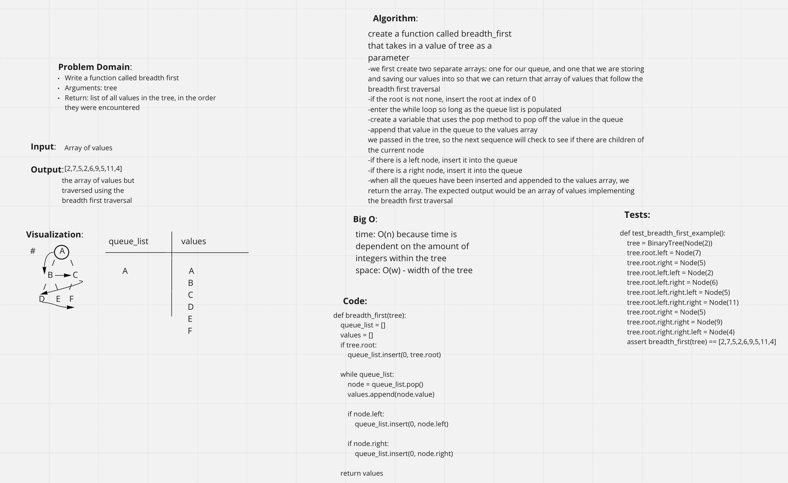

## Breadth first
From the reading and the lecture, I got a better understanding of how tree works, the differences between them, and the processes of how to "solve" (lack of better words)

Vocab for reference:
Depth first- going through the height of the tree, iterates through all of the trees, first and on-queuing an call stack to return an array of the tree traversal (three types, pre-order (root, left, right), in order(left, root, right), post order(left, right,root)

Breadth first- iterated through the entire tree until theres no more nodes (level to level)

Leaf- node that does not have any children (bottom of the tree)

K-aray- refers to max number of children that each Node can have. Doesn’t strictly have a left or right node, it just moves down levels and will read the node children.

Binary- numbers on the left have to be smaller, and based on the right the numbers have to be bigger. It will always check the root to see if the number you’re searching for is greater or smaller than the root, smaller is left, greater is right, will check the root again..etc

## Challenge
Write a function called breadth first
Arguments: tree
Return: list of all values in the tree, in the order they were encountered

## Approach & Efficiency
I worked with Brandon Mizutani

we first create two separate arrays: one for our queue, and one that we are storing and saving our values into so that we can return that array of values that follow the breadth first traversal
-if the root is not none, insert the root at index of 0
-enter the while loop so long as the queue list is populated
-create a variable that uses the pop method to pop off the value in the queue
-append that value in the queue to the values array
we passed in the tree, so the next sequence will check to see if there are children of the current node
-if there is a left node, insert it into the queue
-if there is a right node, insert it into the queue
-when all the queues have been inserted and appended to the values array, we return the array. The expected output would be an array of values implementing the breadth first traversal

## API
**pre_order** - root >> left >> right
**in_order** - left >> root >> right
**post-order** - left >> right >> root (returns an array of the values, ordered appropriately.)
**add** - Adds a new node with that value in the correct location in the binary search tree.
**contains** - Returns: boolean indicating whether or not the value is in the tree at least once.

Not able to do testing so I can't add my tests here- slacked JB

