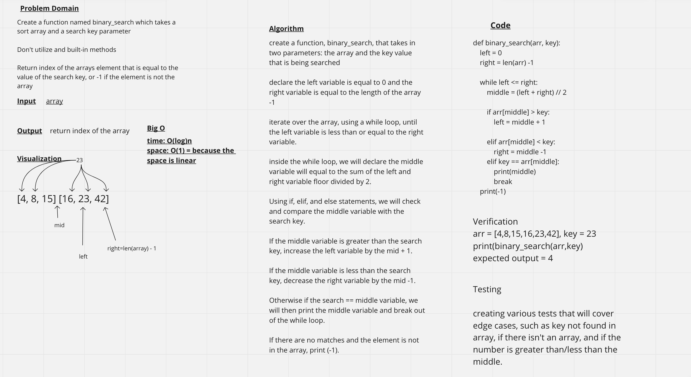

# Binary Search of Sorted Array
Create a function named binary_search which takes a sort array and a search key parameter

Don't utilize and built-in methods

Return index of the arrays element that is equal to the value of the search key, or -1 if the element is not the array

## Whiteboard Process

## Approach & Efficiency
Worked with Brandon M
create a function, binary_search, that takes in two parameters: the array and the key value that is being searched

declare the left variable is equal to 0 and the right variable is equal to the length of the array -1

iterate over the array, using a while loop, until the left variable is less than or equal to the right variable.

inside the while loop, we will declare the middle variable will equal to the sum of the left and right variable floor divided by 2.

Using if, elif, and else statements, we will check and compare the middle variable with the search key.

If the middle variable is greater than the search key, increase the left variable by the mid + 1.

If the middle variable is less than the search key, decrease the right variable by the mid -1.

Otherwise if the search == middle variable, we will then print the middle variable and break out of the while loop.

If there are no matches and the element is not in the array, print (-1).
