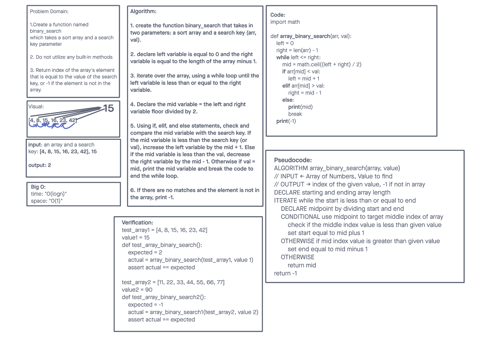

# Insert to Middle of an Array
customer wants to add an item in the middle of a list

## Whiteboard Process

## Approach & Efficiency
Worked with Brandon M
Find lenth of list
Find middle index devide by 1
Insert new number
Return new list
